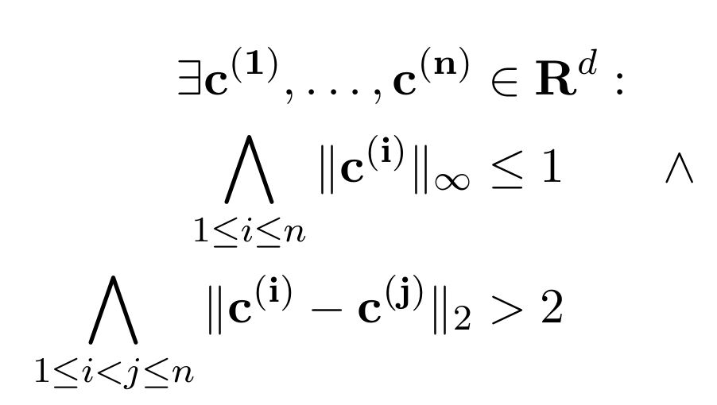

# LPPaver

LPPaver is an automated prover which targets problems involving nonlinear real arithmetic.
A paper describing LPPaver in detail is coming soon.

## Documentation

[Haddock](https://haskell-haddock.readthedocs.io/en/latest/) documentation for LPPaver can be found at [Hackage](https://hackage.haskell.org/package/LPPaver).

## Reference

LPPaver understands input that is similar to SMT2.
LPPaver is designed to work with SMT2 `assert`s.
If an `assert` contains anything that LPPaver does not understand, the `assert`ion is (currently) silently dropped.
The full list of accepted inputs can be found in [REFERENCE.md](REFERENCE.md)

## Building

LPPaver can be built with either [Stack](https://docs.haskellstack.org/en/stable/) or [Cabal](https://www.haskell.org/cabal/), though officially we only support Stack.

### Stack

```sh
stack build
```

### Cabal

```sh
cabal build
```

## Examples

Examples can be found in directory [test/testFiles](test/testFiles).
The [Place](test/testFiles/Place) directory contains examples that describe the problem of placing circles of a fixed size into a square of a fixed size in such a way that all of the circles are within the square none of the circles are touching each-other or the edges of the square.
The problem has also been generalised to higher dimensions.
A formula describing the problem is shown below:



The [PropaFP](test/testFiles/PropaFP) directory contains examples that came from [PropaFP](https://github.com/rasheedja/PropaFP/).
These examples are described in detail in a [preprint of a paper describing PropaFP](https://arxiv.org/abs/2207.00921).

In both directories, the sat subdirectory holds files which should be satisfiable, the unsat subdirectory holds files which should be unsatisfiable, and the cannotDecide subdirectory holds files which LPPaver could not decide with default parameters.
